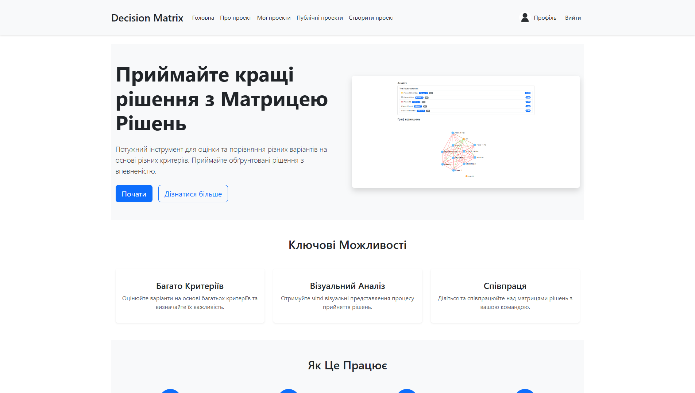
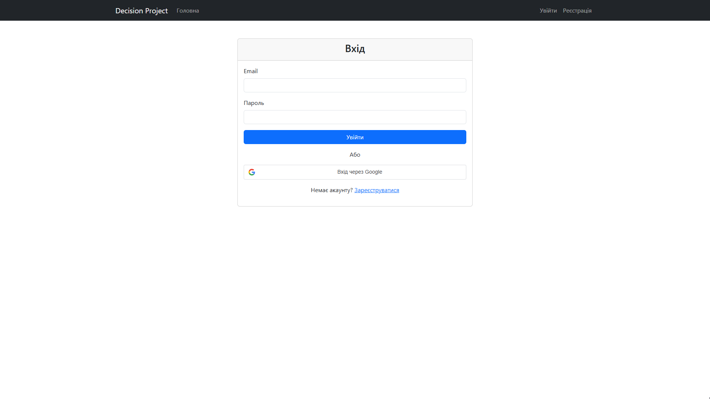
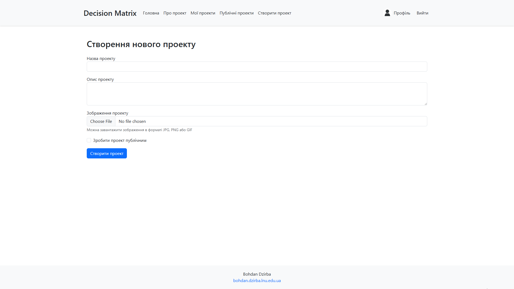
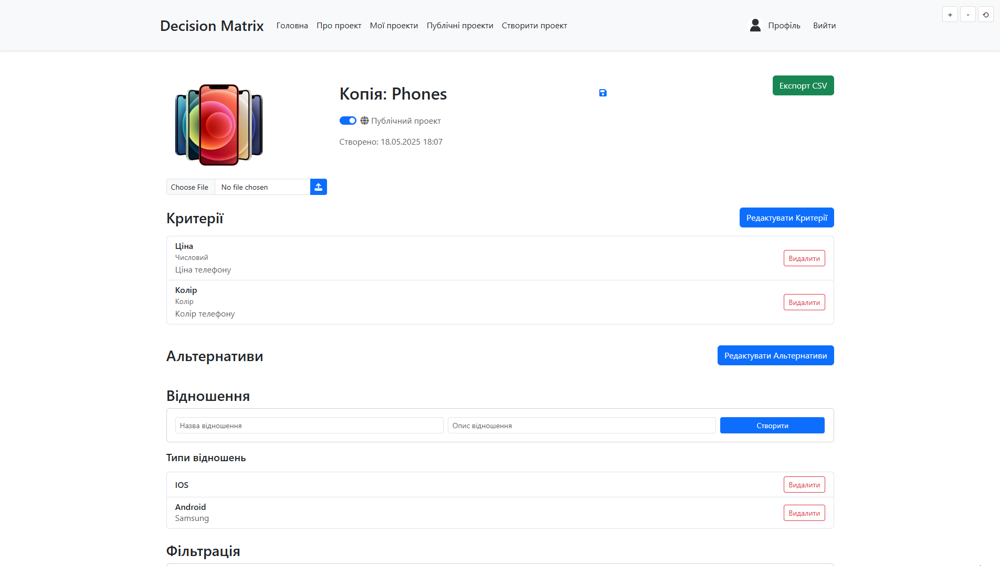
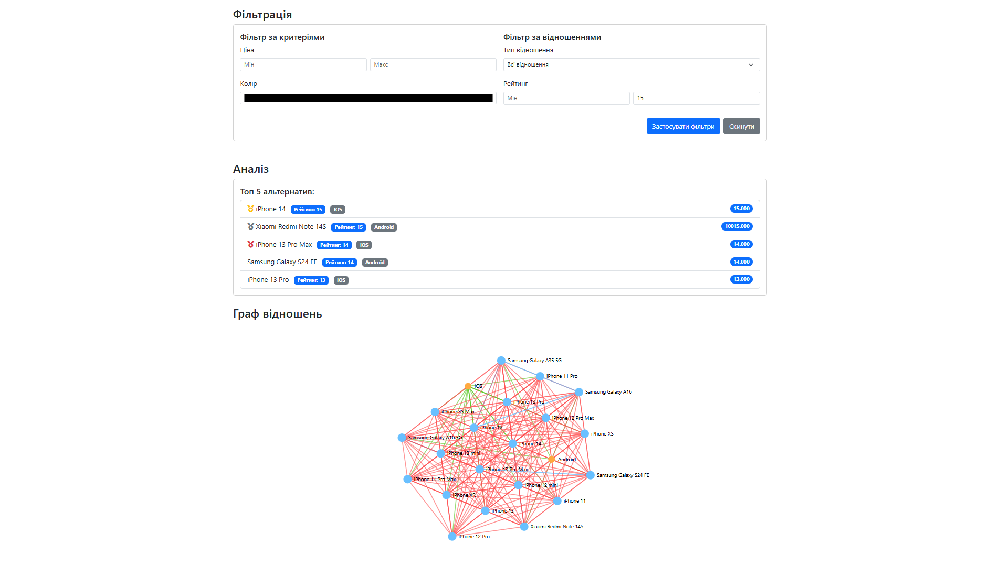

# 📘 Decision Project

> Потужний додаток для прийняття рішень на основі Django, який допомагає користувачам приймати обґрунтовані рішення через структурований аналіз та порівняння альтернатив.

---

## 👤 Автор

- **ПІБ**: Дзірба Б. П.
- **Група**: ФеП-41
- **Керівник**: Катеринчук Іван Миколайович к.ф.-м.н., доцент
- **Дата виконання**: [31.05.2025]

---

## 📌 Загальна інформація

- **Тип проєкту**: Веб-додаток
- **Мова програмування**: Python
- **Фреймворки / Бібліотеки**: Django, Django REST Framework, Bootstrap, NetworkX

---

## 🧠 Опис функціоналу

- 🔐 Реєстрація та авторизація (email + Google OAuth)
- 📊 Створення проєктів для прийняття рішень
- 💡 Додавання альтернатив з критеріями оцінювання
- 📈 Візуалізація зв'язків між альтернативами
- 🤝 Спільна робота над проєктами
- 🔄 REST API для інтеграції з іншими сервісами
- 📊 Мережевий аналіз за допомогою NetworkX

---

## 🧱 Опис основних класів / файлів

| Клас / Файл               | Призначення |
|---------------------------|-------------|
| `authentication/`         | Аутентифікація та керування користувачами |
| `main/`                   | Функціонал прийняття рішень |
| `decisionproject/settings.py` | Головні налаштування проєкту |
| `authentication/models.py` | Моделі користувачів та профілів |
| `main/models.py`          | Моделі проєктів, альтернатив, критеріїв |
| `main/views.py`           | Логіка обробки запитів |
| `api/views.py`            | API ендпоінти |

---

## ▶️ Як запустити проєкт "з нуля"

### 1. Клонуйте репозиторій:
   ```bash
   git clone https://github.com/Freybii/decision_project.git
   cd decision_project
   ```

### 2. Створіть та активуйте віртуальне середовище:
   ```bash
   python -m venv .venv
   source .venv/bin/activate  # On Windows: .venv\Scripts\activate
   ```

### 3. Встановіть залежності:
   ```bash
   pip install -r requirements.txt
   ```

### 4. Налаштуйте змінні середовища:
   ```bash
   cp .env.example .env
   # Edit .env with your configuration
   ```

### 5. Виконайте міграції:
   ```bash
   python manage.py migrate
   ```

### 6. Створіть суперкористувача:
   ```bash
   python manage.py createsuperuser
   ```

### 7. Запустіть сервер розробки:
   ```bash
   python manage.py runserver
   ```
   
## 🔌 API приклади

### 🔐 Авторизація

**POST /api/auth/login**

```json
{
  "email": "user@example.com",
  "password": "securepassword"
}
```

**Response:**

```json
{
  "access": "jwt_access_token",
  "refresh": "jwt_refresh_token"
}
```

---

### 📋 Проєкти

**GET /api/projects/**  
Отримати список усіх проєктів користувача.

**POST /api/projects/**

```json
{
  "name": "Новий проєкт",
  "description": "Короткий опис проєкту"
}
```

**GET /api/projects/:id/**  
Отримати деталі одного проєкту.

**PUT /api/projects/:id/**

```json
{
  "name": "Оновлена назва проєкту",
  "description": "Оновлений опис"
}
```

**DELETE /api/projects/:id/**  
Видалити проєкт.

---

### 🧩 Альтернативи

**GET /api/projects/:id/alternatives/**  
Отримати всі альтернативи в межах проєкту.

**POST /api/projects/:id/alternatives/**

```json
{
  "name": "Альтернатива 1",
  "description": "Опис альтернативи"
}
```

**PUT /api/alternatives/:id/**

```json
{
  "name": "Оновлена альтернатива"
}
```

**DELETE /api/alternatives/:id/**  
Видалити альтернативу.

---

### 🔁 Відношення

**POST /api/projects/:id/relations/**

```json
{
  "from_alternative_id": 1,
  "to_alternative_id": 2,
  "type": "dominance"
}
```

**GET /api/projects/:id/graph/**  
Отримати граф альтернатив (у вигляді матриці або списку суміжності).

---

## 🖱️ Інструкція для користувача

1. **Головна сторінка**:
   - `🔐 Увійти через Google` — авторизація через Google OAuth
   - `📝 Зареєструватись` — створення акаунту з email

2. **Після входу**:
   - `➕ Створити проєкт` — новий проєкт для аналізу
   - `📂 Переглянути проєкти` — список наявних
   - У межах проєкту:
     - `➕ Додати альтернативу`
     - `🔗 Задати відношення`
     - `📊 Переглянути граф відношень`
     - `🗑️ Видалити альтернативу або проєкт`

3. **Інші функції**:
   - `🚪 Вийти` — завершення сесії

---

## 📷 Приклади / скриншоти

- Головна сторінка
 
- Головна входу в обліковий запис

- Форма створення проєкту

- Сторінка проєкту

- Візуалізація графа



---

## 🧪 Проблеми і рішення

| Проблема                    | Рішення                                         |
|----------------------------|--------------------------------------------------|
| 500 Internal Server Error  | Перевірити конфігурацію `.env`, виконати `migrate` |
| CORS помилка               | Увімкнути CORS у `settings.py`                   |
| Альтернативи не зберігаються | Перевірити пов’язані проєкти та API-запити     |
| Візуалізація не відображається | Перевірити доступність NetworkX графу в API  |

---

## 🧾 Використані джерела / література

- [Django офіційна документація](https://docs.djangoproject.com/)
- [Django REST Framework](https://www.django-rest-framework.org/)
- [NetworkX](https://networkx.org/)
- [JWT.io](https://jwt.io/)
- [Google OAuth 2.0](https://developers.google.com/identity/protocols/oauth2)
- [StackOverflow](https://stackoverflow.com/)
- [GitHub Discussions](https://github.com/)